# 📛 Copilot API

⚠️ **EDUCATIONAL PURPOSE ONLY** ⚠️  
This project is a reverse-engineered implementation of the GitHub Copilot API created for educational purposes only. It is not officially supported by GitHub and should not be used in production environments. Please be aware that using this proxy may violate GitHub's Terms of Service.

A TypeScript/Node.js proxy server that wraps GitHub Copilot's API to make it OpenAI-compatible, enabling integration with AI assistants, local interfaces, and development tools that expect OpenAI's API format.

This is a fork of [ericc-ch/copilot-api](https://github.com/ericc-ch/copilot-api) that provides additional features while staying in sync with the upstream project. Features may be contributed back to the original project.

## 🚀 Features

- **OpenAI API Compatibility**: Translates OpenAI-style requests to GitHub Copilot format
- **GitHub OAuth Authentication**: Secure device flow authentication with GitHub
- **Rate Limiting**: Built-in request throttling with configurable limits
- **Business Account Support**: Compatible with both individual and business Copilot subscriptions  
- **Multiple Installation Methods**: Run via npx, Docker/Podman, or from source
- **Manual Request Approval**: Optional interactive mode for request review
- **Vision Support**: Handle image inputs in chat completions
- **Comprehensive Testing**: 80%+ test coverage goal with unit and integration tests
- **Stream & Non-Stream Support**: Compatible with both streaming and non-streaming responses

## 📦 Installation

### Using npx (Recommended)

Run directly without cloning the repository:

```bash
# Start the server
npx copilot-api@latest start

# Custom port
npx copilot-api@latest start --port 8080

# Generate GitHub token only
npx copilot-api@latest auth
```

### Using Docker

```bash
# Build the image
docker build -t copilot-api .

# Run without token (will prompt for auth)
docker run --init -it -p 4141:4141 copilot-api

# Run with pre-generated token
docker run --init -it -e GH_TOKEN="your_token_here" -p 4141:4141 copilot-api

# Generate token in container
docker run -it --rm copilot-api sh -c '
    bun run dist/main.js auth && \
    echo "GitHub Token: $(cat /root/.local/share/copilot-api/github_token)"'
```

### Using Podman

```bash
# Build the image
podman build -t copilot-api .

# Run without token (will prompt for auth)
podman run --init -it -p 4141:4141 copilot-api

# Run with pre-generated token
podman run --init -it -e GH_TOKEN="your_token_here" -p 4141:4141 copilot-api
```

### From Source

Prerequisites: Bun >= 1.2.x

```bash
# Clone and install
git clone https://github.com/ekartashov/copilot-api.git
cd copilot-api
bun install

# Development mode
bun run dev

# Production mode
bun run start
```

## ⚙️ Configuration

### Environment Variables

| Variable | Description | Default |
|----------|-------------|---------|
| `GH_TOKEN` | Pre-generated GitHub token | None |
| `NODE_ENV` | Environment mode | `development` |

### CLI Flags

#### Start Command
| Flag | Description | Default | Alias |
|------|-------------|---------|-------|
| `--port` | Port to listen on | `4141` | `-p` |
| `--verbose` | Enable verbose logging | `false` | `-v` |
| `--business` | Use business plan GitHub account | `false` | |
| `--manual` | Enable manual request approval | `false` | |
| `--rate-limit` | Rate limit seconds between requests | None | `-r` |
| `--wait` | Wait instead of error on rate limit | `false` | `-w` |
| `--github-token` | Provide GitHub token directly | None | `-g` |

#### Auth Command
| Flag | Description | Default | Alias |
|------|-------------|---------|-------|
| `--verbose` | Enable verbose logging | `false` | `-v` |

## 🧪 Testing

The project includes comprehensive testing with Bun's native test runner:

```bash
# Run all tests
bun test

# Watch mode (auto-rerun on changes)
bun run test:watch

# Coverage report
bun run test:coverage

# CI mode
bun run test:ci
```

### Test Structure
- **`test/lib/`** - Unit tests for utilities and core functions
- **`test/routes/`** - Integration tests for API endpoints  
- **`test/services/`** - Service layer tests
- **Coverage target**: 80%+ with HTML and LCOV reports

## 🔧 Usage Examples

### CLI Commands

```bash
# Basic usage
npx copilot-api@latest start

# Custom port with verbose logging
npx copilot-api@latest start --port 8080 --verbose

# Business account with rate limiting
npx copilot-api@latest start --business --rate-limit 30

# Manual approval mode
npx copilot-api@latest start --manual

# With rate limit waiting
npx copilot-api@latest start --rate-limit 30 --wait

# Direct token usage
npx copilot-api@latest start --github-token ghp_YOUR_TOKEN
```

### API Usage

Once running, use OpenAI-compatible endpoints:

```bash
# Chat completions
curl -X POST http://localhost:4141/chat/completions \
  -H "Content-Type: application/json" \
  -d '{
    "model": "gpt-4",
    "messages": [{"role": "user", "content": "Hello!"}],
    "stream": false
  }'

# List available models  
curl http://localhost:4141/models

# Embeddings
curl -X POST http://localhost:4141/embeddings \
  -H "Content-Type: application/json" \
  -d '{
    "model": "text-embedding-ada-002",
    "input": "Hello world"
  }'
```

### Compatible with v1/ prefix
All endpoints also work with `/v1/` prefix for broader tool compatibility:
- `/v1/chat/completions`
- `/v1/models` 
- `/v1/embeddings`

## 🔄 How It Works

```mermaid
graph TD
  A["Client (e.g. AI Assistant)"] -->|OpenAI-style request| B("Copilot API Proxy")
  B --> C["Request Rewriter"]
  C --> D["GitHub Copilot Backend"]
  D --> E["Copilot Response"]
  E --> F["Response Translator"]
  F --> A
  B -.-> G["Auth Layer (GitHub OAuth)"]
  G -->|Token| B
  style B fill:#b37700,stroke:#000,stroke-width:2px
  style D fill:#002642,stroke:#000,stroke-width:1px
  style G fill:#b91c1c,stroke:#000,stroke-width:1px
```



The proxy server:
1. **Receives** OpenAI-format requests from clients
2. **Authenticates** with GitHub using OAuth device flow
3. **Translates** requests to GitHub Copilot's internal API format
4. **Forwards** requests to GitHub's Copilot backend
5. **Converts** responses back to OpenAI-compatible format
6. **Returns** formatted responses to clients

Key components:
- **Request Handler**: Processes incoming requests and applies rate limiting
- **Auth Layer**: Manages GitHub authentication and token refresh
- **Translation Layer**: Converts between OpenAI and Copilot formats
- **Response Streaming**: Supports both streaming and non-streaming responses

## 📚 Documentation

| Guide | Description |
|-------|-------------|
| **[Getting Started](docs/index.md)** | Quick setup and usage guide |
| **[API Reference](docs/api.md)** | Complete OpenAI-compatible endpoint documentation |
| **[CLI Guide](docs/cli.md)** | Command-line interface usage and options |
| **[Configuration](docs/config.md)** | Environment variables and advanced settings |
| **[Authentication](docs/auth.md)** | GitHub OAuth flow and token management |
| **[Architecture](docs/architecture.md)** | Technical implementation and system design |
| **[Deployment](docs/deployment.md)** | Production deployment for Docker/K8s/systemd |
| **[Testing](docs/testing.md)** | Testing framework, patterns, and coverage |
| **[Contributing](docs/contributing.md)** | Development workflow and contribution guidelines |

> 💡 **New to the project?** Start with the [Getting Started Guide](docs/index.md) for a quick overview and setup instructions.

## 🤝 Contributing

We welcome contributions! Please see our [Contributing Guide](docs/contributing.md) for detailed guidelines on:
- Setting up the development environment
- Running tests and linting
- Submitting pull requests
- Code style and conventions

## 📄 License & Disclaimer

This project is licensed under the MIT License - see the [LICENSE.md](LICENSE.md) file for details.

**Important Disclaimers:**
- This is an **educational project** created through reverse engineering
- It is **not officially supported** by GitHub or Microsoft
- Use may **violate GitHub's Terms of Service**
- **Not recommended for production use**
- Users assume all responsibility for compliance with applicable terms and policies

**Prerequisites:**
- GitHub account with active Copilot subscription (Individual or Business)
- Understanding that this proxy intercepts and modifies API communications

Use responsibly and at your own risk.
