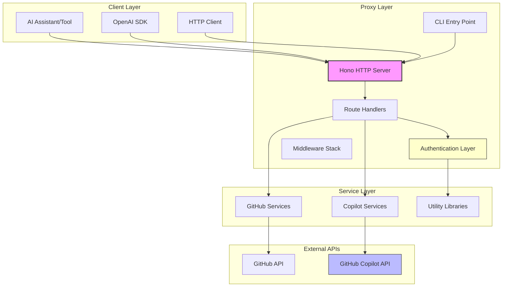
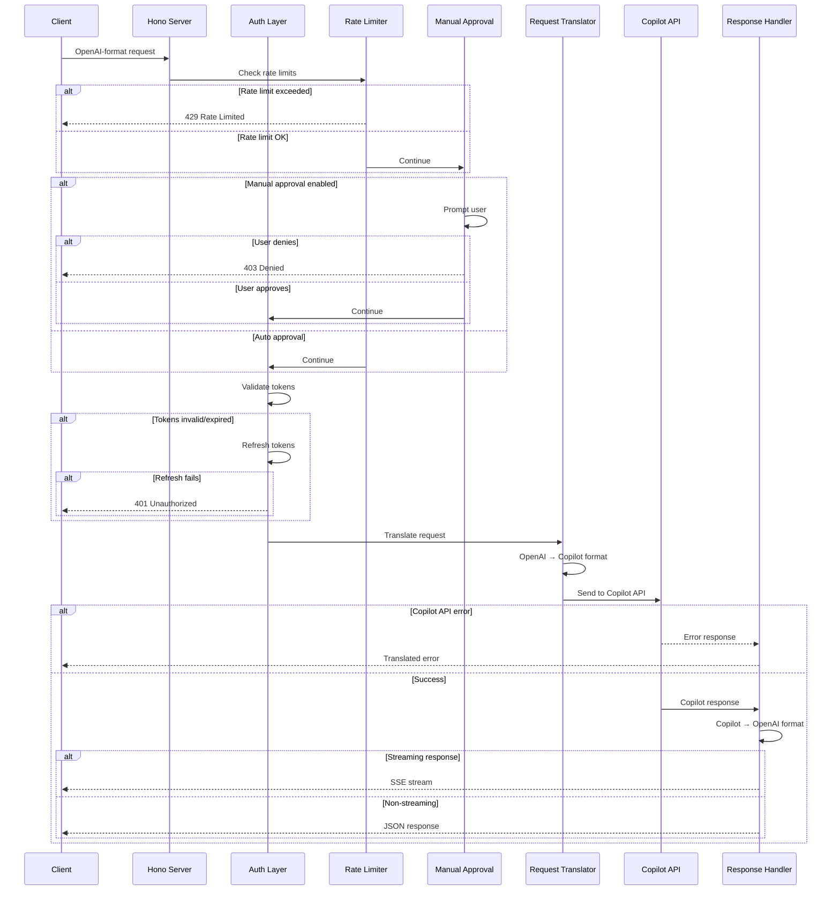
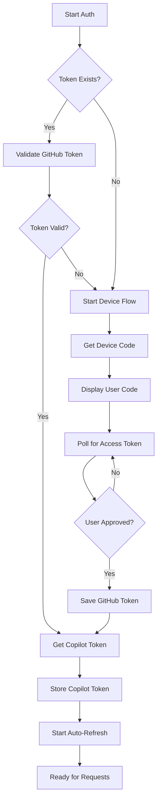
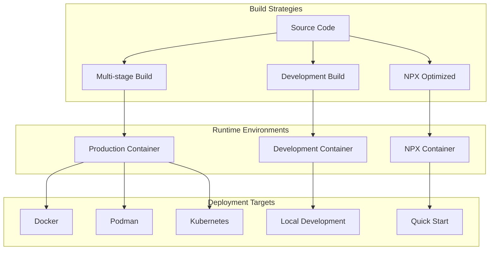
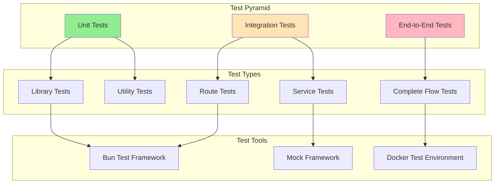

# Architecture Documentation

This document provides detailed technical architecture documentation for the GitHub Copilot API proxy, covering system design, implementation patterns, and architectural decisions.

## Overview

The Copilot API proxy is a TypeScript/Node.js application that acts as a translation layer between OpenAI-compatible clients and GitHub's Copilot API. It implements a reverse proxy pattern with authentication management, request translation, and response formatting.

## High-Level Architecture



## Request/Response Flow

### Complete Request Lifecycle



## Component Architecture

### CLI Entry Points (Citty Framework)

**File**: [`src/main.ts`](../src/main.ts)

```typescript
// CLI command structure using citty
const main = defineCommand({
  meta: {
    name: "copilot-api",
    description: "OpenAI-compatible wrapper for GitHub Copilot"
  },
  subCommands: { 
    auth,    // Authentication flow
    start    // Server startup
  }
})
```

**Architecture Pattern**: Command pattern with subcommand delegation

**Key Components**:
- **`start` command**: Server initialization and configuration
- **`auth` command**: GitHub OAuth device flow
- **Option parsing**: Type-safe CLI argument handling
- **Error handling**: Graceful failure with user-friendly messages

### Server Logic (Hono Framework)

**File**: [`src/server.ts`](../src/server.ts)

```typescript
// HTTP server setup with middleware stack
export const server = new Hono()

server.use(logger())    // Request logging
server.use(cors())      // CORS headers

// Route registration with v1 compatibility
server.route("/chat/completions", completionRoutes)
server.route("/v1/chat/completions", completionRoutes)
```

**Architecture Patterns**:
- **Middleware pipeline**: Request processing chain
- **Route composition**: Modular endpoint organization  
- **Dual path support**: `/` and `/v1/` endpoint compatibility

**Middleware Stack**:
1. **Logger**: Request/response logging
2. **CORS**: Cross-origin resource sharing
3. **Route handlers**: Endpoint-specific processing

### Authentication System

**Files**: [`src/auth.ts`](../src/auth.ts), [`src/lib/token.ts`](../src/lib/token.ts)



**Key Components**:

#### GitHub OAuth Device Flow
```typescript
// Device code request
export async function getDeviceCode(): Promise<DeviceCodeResponse> {
  const response = await fetch(`${GITHUB_BASE_URL}/login/device/code`, {
    method: "POST",
    headers: standardHeaders(),
    body: JSON.stringify({
      client_id: GITHUB_CLIENT_ID,
      scope: GITHUB_APP_SCOPES,
    }),
  })
  return await response.json()
}
```

#### Token Management
```typescript
// Automatic Copilot token refresh
export const setupCopilotToken = async () => {
  const { token, refresh_in } = await getCopilotToken()
  state.copilotToken = token

  const refreshInterval = (refresh_in - 60) * 1000

  setInterval(async () => {
    const { token } = await getCopilotToken()
    state.copilotToken = token
  }, refreshInterval)
}
```

**Security Features**:
- **Secure token storage**: File permissions (600)
- **Automatic refresh**: Proactive token renewal
- **Error recovery**: Fallback authentication flows

### Request Translation Layer

**Files**: [`src/routes/chat-completions/handler.ts`](../src/routes/chat-completions/handler.ts), [`src/services/copilot/`](../src/services/copilot/)

#### OpenAI → Copilot Translation

```typescript
// Message content translation
const intoCopilotMessage = (message: Message) => {
  if (typeof message.content === "string") return false

  for (const part of message.content) {
    // OpenAI uses "input_image", Copilot uses "image_url"
    if (part.type === "input_image") part.type = "image_url"
  }
}
```

#### Vision Support Detection

```typescript
// Detect vision-enabled requests
const visionEnable = payload.messages.some(
  (x) =>
    typeof x.content !== "string" &&
    x.content.some((x) => x.type === "image_url")
)

const response = await fetch(`${copilotBaseUrl(state)}/chat/completions`, {
  headers: copilotHeaders(state, visionEnable),
  body: JSON.stringify(payload),
})
```

### Rate Limiting System

**File**: [`src/lib/rate-limit.ts`](../src/lib/rate-limit.ts)

```typescript
export async function checkRateLimit(state: State): Promise<void> {
  if (!state.rateLimitSeconds) return

  const now = Date.now()
  const timeSinceLastRequest = state.lastRequestTimestamp 
    ? now - state.lastRequestTimestamp 
    : state.rateLimitSeconds * 1000

  if (timeSinceLastRequest < state.rateLimitSeconds * 1000) {
    const waitTime = state.rateLimitSeconds * 1000 - timeSinceLastRequest

    if (state.rateLimitWait) {
      await sleep(waitTime)  // Block until rate limit window passes
    } else {
      throw new HTTPError(`Rate limit exceeded. Please wait ${Math.ceil(waitTime / 1000)} seconds.`, 
        createMockResponse({}, 429))
    }
  }

  state.lastRequestTimestamp = now
}
```

**Design Patterns**:
- **Token bucket**: Request timing control
- **Configurable behavior**: Error vs. wait modes
- **State persistence**: Request timestamp tracking

### Manual Approval System

**File**: [`src/lib/approval.ts`](../src/lib/approval.ts)

```typescript
export async function awaitApproval(): Promise<void> {
  return new Promise((resolve, reject) => {
    const rl = readline.createInterface({
      input: process.stdin,
      output: process.stdout
    })

    rl.question("Approve request? (y/N): ", (answer) => {
      rl.close()
      
      if (answer.toLowerCase() === 'y' || answer.toLowerCase() === 'yes') {
        resolve()
      } else {
        reject(new HTTPError("Request denied by user", createMockResponse({}, 403)))
      }
    })
  })
}
```

## State Management

### Global Application State

**File**: [`src/lib/state.ts`](../src/lib/state.ts)

```typescript
export interface State {
  // Authentication
  githubToken?: string      // GitHub personal access token
  copilotToken?: string     // Copilot API token (auto-generated)
  
  // Configuration
  accountType: string       // "individual" or "business"
  manualApprove: boolean    // Manual request approval flag
  rateLimitWait: boolean    // Wait vs error on rate limit
  
  // Runtime data
  models?: ModelsResponse   // Cached available models
  vsCodeVersion?: string    // VS Code version for API headers
  
  // Rate limiting
  rateLimitSeconds?: number
  lastRequestTimestamp?: number
}
```

**State Management Patterns**:
- **Singleton pattern**: Global state object
- **Immutable operations**: Avoid direct mutation where possible
- **Type safety**: Full TypeScript interface definition

### Configuration Management

**File**: [`src/lib/api-config.ts`](../src/lib/api-config.ts)

```typescript
// Account-specific API endpoints
export const copilotBaseUrl = (state: State) =>
  `https://api.${state.accountType}.githubcopilot.com`

// Dynamic header generation
export const copilotHeaders = (state: State, vision: boolean = false) => {
  const headers = {
    Authorization: `Bearer ${state.copilotToken}`,
    "copilot-integration-id": "vscode-chat",
    "editor-version": `vscode/${state.vsCodeVersion}`,
    "editor-plugin-version": EDITOR_PLUGIN_VERSION,
    "user-agent": USER_AGENT,
    "openai-intent": "conversation-panel",
    "x-github-api-version": API_VERSION,
    "x-request-id": randomUUID(),
  }

  if (vision) headers["copilot-vision-request"] = "true"
  return headers
}
```

## Service Layer Architecture

### GitHub Services

**Directory**: [`src/services/github/`](../src/services/github/)

**Service Pattern**: Each service handles a specific GitHub API interaction

```typescript
// get-device-code.ts - OAuth device flow initiation
export async function getDeviceCode(): Promise<DeviceCodeResponse>

// poll-access-token.ts - OAuth token polling
export async function pollAccessToken(deviceCode: DeviceCodeResponse): Promise<string>

// get-user.ts - User information retrieval
export async function getGitHubUser(): Promise<GitHubUser>

// get-copilot-token.ts - Copilot API token exchange
export async function getCopilotToken(): Promise<CopilotTokenResponse>
```

### Copilot Services

**Directory**: [`src/services/copilot/`](../src/services/copilot/)

```typescript
// create-chat-completions.ts - Chat completion handling
export async function createChatCompletions(
  payload: ChatCompletionsPayload
): Promise<ChatCompletionResponse | AsyncIterable<SSEMessage>>

// get-models.ts - Available models retrieval
export async function getModels(): Promise<ModelsResponse>

// create-embeddings.ts - Text embedding generation
export async function createEmbeddings(
  payload: EmbeddingsPayload
): Promise<EmbeddingsResponse>
```

### Error Handling Strategy

**File**: [`src/lib/http-error.ts`](../src/lib/http-error.ts)

```typescript
export class HTTPError extends Error {
  constructor(
    message: string,
    public response: Response
  ) {
    super(message)
    this.name = "HTTPError"
  }
}
```

**Error Propagation Pattern**:
1. **Service layer**: Throw `HTTPError` for API failures
2. **Route handlers**: Catch and translate errors
3. **Client response**: OpenAI-compatible error format

```typescript
// Service layer error handling
if (!response.ok) {
  throw new HTTPError("Failed to create chat completions", response)
}

// Route handler error translation
try {
  const result = await createChatCompletions(payload)
  return c.json(result)
} catch (error) {
  if (error instanceof HTTPError) {
    const errorData = await error.response.json()
    return c.json({
      error: {
        message: "Request failed",
        type: "api_error",
        code: "copilot_api_error"
      }
    }, error.response.status)
  }
  throw error
}
```

## Deployment Scenarios

### Containerization Strategy

**Files**: [`Dockerfile`](../Dockerfile), [`Dockerfile.dev`](../Dockerfile.dev), [`Dockerfile.npx`](../Dockerfile.npx)



#### Multi-stage Production Build

```dockerfile
# Dependencies stage
FROM oven/bun:1.1.38-alpine AS deps
WORKDIR /app
COPY package.json bun.lock bunfig.toml ./
RUN bun install --frozen-lockfile --production

# Build stage  
FROM oven/bun:1.1.38-alpine AS build
WORKDIR /app
COPY package.json bun.lock bunfig.toml tsconfig.json tsup.config.ts ./
COPY src ./src
RUN bun install --frozen-lockfile
RUN bun run build

# Runtime stage
FROM oven/bun:1.1.38-alpine AS runtime
WORKDIR /app
COPY --from=deps /app/node_modules ./node_modules
COPY --from=build /app/dist ./dist
COPY package.json ./

EXPOSE 4141
CMD ["bun", "run", "dist/main.js", "start"]
```

### Runtime Environment Support

**Supported Runtimes**:
- **Bun** (primary): Native TypeScript execution
- **Node.js**: Compiled JavaScript execution
- **Docker/Podman**: Containerized deployment
- **NPX**: Direct package execution

## Testing Architecture

### Test Strategy Overview



### Test Design Philosophy

**Principles**:
1. **Fast feedback loops**: Unit tests run in milliseconds
2. **Isolated testing**: No external dependencies in unit tests
3. **Realistic integration**: Service tests use actual HTTP patterns
4. **Coverage-driven**: Maintain 80%+ code coverage
5. **Regression prevention**: Test critical paths thoroughly

**Testing Patterns**:

#### Unit Test Pattern
```typescript
// test/lib/utility.test.ts
import { test, expect, describe } from "bun:test"
import { utilityFunction } from "../../src/lib/utility"

describe("utilityFunction", () => {
  test("should handle expected input", () => {
    // Arrange
    const input = "test"
    
    // Act  
    const result = utilityFunction(input)
    
    // Assert
    expect(result).toBe("expected")
  })
})
```

#### Integration Test Pattern
```typescript
// test/routes/endpoint.test.ts
import { test, expect, describe } from "bun:test"
import { server } from "../../src/server"

describe("API Endpoint", () => {
  test("should handle valid request", async () => {
    const request = new Request("http://localhost:4141/endpoint", {
      method: "POST",
      body: JSON.stringify({ data: "test" })
    })

    const response = await server.fetch(request)
    expect(response.status).toBe(200)
  })
})
```

## Performance Considerations

### Request Processing Optimization

**Strategies**:
1. **Token caching**: Avoid repeated API calls
2. **Model caching**: Cache available models list
3. **Connection reuse**: HTTP keep-alive for external requests
4. **Streaming support**: Reduce perceived latency

### Memory Management

```typescript
// Efficient streaming handling
export async function handleCompletion(c: Context) {
  const response = await createChatCompletions(payload)

  if (isNonStreaming(response)) {
    return c.json(response)
  }

  // Stream processing without buffering entire response
  return streamSSE(c, async (stream) => {
    for await (const chunk of response) {
      await stream.writeSSE(chunk as SSEMessage)
    }
  })
}
```

### Resource Cleanup

```typescript
// Automatic token refresh with cleanup
const refreshInterval = setInterval(async () => {
  try {
    const { token } = await getCopilotToken()
    state.copilotToken = token
  } catch (error) {
    consola.error("Failed to refresh Copilot token:", error)
  }
}, refreshInterval)

// Cleanup on process termination
process.on('SIGTERM', () => {
  clearInterval(refreshInterval)
})
```

## Security Architecture

### Authentication Security

**Measures**:
1. **Secure token storage**: 600 file permissions
2. **Token rotation**: Automatic refresh before expiration
3. **Scope limitation**: Minimal GitHub permissions (`read:user`)
4. **No token logging**: Sensitive data excluded from logs

### Network Security

```typescript
// HTTPS-only communication
const GITHUB_BASE_URL = "https://github.com"
const GITHUB_API_BASE_URL = "https://api.github.com"

// Request validation
export async function validateRequest(payload: any): Promise<boolean> {
  // Input sanitization and validation
  return true
}
```

### Rate Limiting Security

```typescript
// Prevent API abuse
export async function checkRateLimit(state: State): Promise<void> {
  if (!state.rateLimitSeconds) return
  
  const timeSinceLastRequest = Date.now() - (state.lastRequestTimestamp || 0)
  
  if (timeSinceLastRequest < state.rateLimitSeconds * 1000) {
    if (state.rateLimitWait) {
      await sleep(waitTime)
    } else {
      throw new HTTPError("Rate limit exceeded", createMockResponse({}, 429))
    }
  }
}
```

## Design Decisions and Trade-offs

### Technology Choices

#### Bun vs Node.js
**Decision**: Primary support for Bun with Node.js fallback
**Rationale**: 
- Faster startup and execution
- Native TypeScript support
- Better developer experience
- Node.js compatibility for broader deployment

#### Hono vs Express
**Decision**: Hono web framework
**Rationale**:
- Better TypeScript support
- Modern async/await patterns
- Edge runtime compatibility
- Smaller bundle size

#### Citty vs Commander
**Decision**: Citty for CLI framework  
**Rationale**:
- Excellent TypeScript integration
- Modern ESM support
- Minimal configuration
- Better error handling

### Architectural Trade-offs

#### Stateful vs Stateless Design
**Choice**: Stateful server with in-memory token management
**Trade-offs**:
- ✅ Faster request processing (no token lookup)
- ✅ Automatic token refresh
- ❌ Not horizontally scalable without shared state
- ❌ Token loss on restart

#### Synchronous vs Asynchronous Processing  
**Choice**: Async-first with blocking for rate limits
**Trade-offs**:
- ✅ Better throughput for concurrent requests
- ✅ Non-blocking I/O operations
- ❌ Complex error handling
- ❌ Rate limiting may block requests

#### Direct Translation vs Full API Emulation
**Choice**: Direct translation with minimal processing
**Trade-offs**:
- ✅ Lower latency
- ✅ Simpler maintenance
- ✅ Reduced error surface
- ❌ Limited customization options
- ❌ Dependent on upstream API changes

## Future Architecture Considerations

### Scalability Improvements

1. **Stateless design**: External token storage (Redis/database)
2. **Load balancing**: Multiple proxy instances
3. **Connection pooling**: Efficient GitHub API usage
4. **Caching layer**: Response caching for repeated requests

### Feature Extensions

1. **Plugin system**: Extensible middleware
2. **Request modification**: Custom request/response processing
3. **Metrics collection**: Performance monitoring
4. **Configuration management**: Dynamic configuration updates

### Security Enhancements

1. **Token encryption**: Encrypted token storage
2. **Request signing**: Cryptographic request validation
3. **Audit logging**: Security event logging
4. **Rate limiting**: Per-client rate limiting

---

**Related Documentation:**
- [API Reference](api.md) - Endpoint specifications and usage
- [Authentication Guide](auth.md) - GitHub OAuth implementation details
- [Testing Documentation](testing.md) - Test architecture and patterns
- [Deployment Guide](deployment.md) - Production deployment strategies