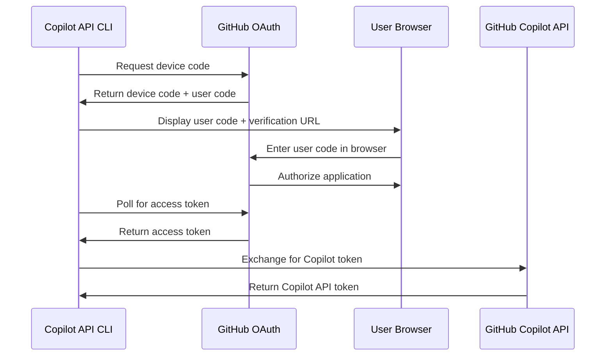
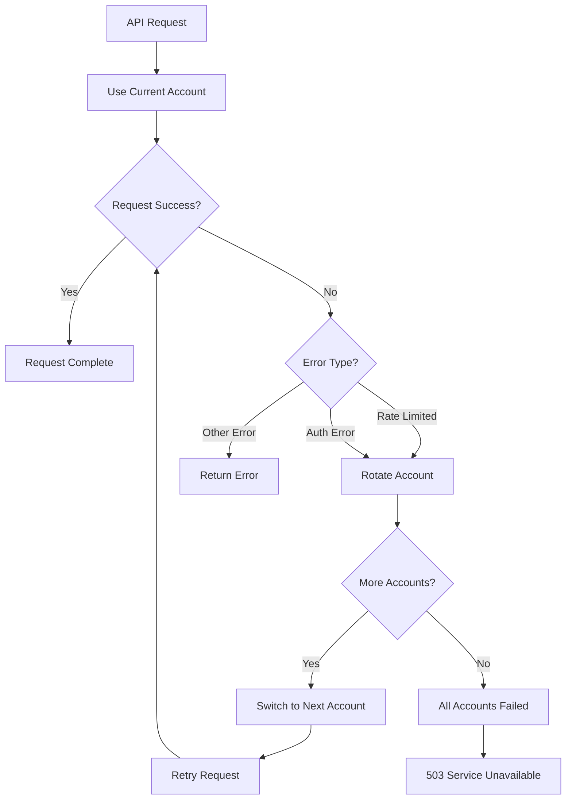

# Authentication & Token Management

This document covers the GitHub OAuth authentication flow and token management system used by the Copilot API proxy.

## Overview

The Copilot API proxy uses GitHub's OAuth device flow to authenticate users and obtain access to GitHub Copilot services. The authentication system manages both GitHub personal access tokens and Copilot API tokens automatically.

## Authentication Flow

### GitHub OAuth Device Flow

The proxy implements GitHub's device flow authentication, which is ideal for CLI applications and headless environments.



### Step-by-Step Process

1. **Device Code Request**: CLI requests a device code from GitHub
2. **User Authorization**: User opens GitHub URL and enters the provided code
3. **Token Polling**: CLI polls GitHub for access token approval
4. **Token Storage**: Successful token is stored locally
5. **Copilot Token**: GitHub token is exchanged for Copilot API access

## Token Management

### GitHub Personal Access Token

**Purpose**: Authenticate with GitHub services and obtain Copilot access

**Scope**: `read:user` - Required for GitHub Copilot access

**Storage Location**: 
- Linux/macOS: `~/.local/share/copilot-api/github_token`
- Windows: `%APPDATA%\copilot-api\github_token`

**File Permissions**: `600` (owner read/write only)

### Copilot API Token

**Purpose**: Direct authentication with GitHub Copilot API

**Lifecycle**: 
- Automatically obtained from GitHub token
- Refreshed automatically before expiration
- Refresh interval: `(refresh_in - 60) seconds`

**Storage**: In-memory only (not persisted to disk)

## Authentication Commands

### Manual Authentication

```bash
# Run authentication flow
copilot-api auth

# With verbose output
copilot-api auth --verbose
```

**Output Example**:
```
ℹ Not logged in, getting new access token
ℹ Please enter the code "ABCD-EFGH" in https://github.com/login/device
✔ Logged in as username
✔ GitHub token written to /home/user/.local/share/copilot-api/github_token
```

### Automatic Authentication

When starting the server, authentication happens automatically:

```bash
# Uses existing token or prompts for new one
copilot-api start

# Force new authentication
rm ~/.local/share/copilot-api/github_token
copilot-api start
```

### Pre-generated Token Usage

You can provide a GitHub token directly:

```bash
# Via command line flag
copilot-api start --github-token ghp_YOUR_TOKEN

# Via environment variable
GH_TOKEN=ghp_YOUR_TOKEN copilot-api start
```

## Token Generation Process

### GitHub App Configuration

The proxy uses a pre-configured GitHub OAuth app:

```typescript
// From src/lib/api-config.ts
export const GITHUB_CLIENT_ID = "Iv1.b507a08c87ecfe98"
export const GITHUB_APP_SCOPES = ["read:user"].join(" ")
```

### Device Code Flow Implementation

```typescript
// Simplified flow from src/services/github/get-device-code.ts
export async function getDeviceCode(): Promise<DeviceCodeResponse> {
  const response = await fetch(`${GITHUB_BASE_URL}/login/device/code`, {
    method: "POST",
    headers: standardHeaders(),
    body: JSON.stringify({
      client_id: GITHUB_CLIENT_ID,
      scope: GITHUB_APP_SCOPES,
    }),
  })

  return await response.json() as DeviceCodeResponse
}
```

### Token Exchange Process

```typescript
// From src/services/github/get-copilot-token.ts
export async function getCopilotToken(): Promise<CopilotTokenResponse> {
  const response = await fetch(`${GITHUB_API_BASE_URL}/copilot_internal/token`, {
    headers: githubHeaders(state),
  })

  return await response.json() as CopilotTokenResponse
}
```

## Account Types

### Individual Accounts

**Default Configuration**:
```bash
copilot-api start  # Uses individual account
```

**API Endpoint**: `https://api.githubcopilot.com`

### Business Accounts

**Configuration**:
```bash
copilot-api start --business
```

**API Endpoint**: `https://api.business.githubcopilot.com`

**Requirements**:
- GitHub Copilot Business subscription
- Organization membership with Copilot access

## Multiple Account Management

The proxy supports managing multiple GitHub accounts with automatic rotation for improved reliability and rate limit handling.

### Account Configuration

**Multiple Token Setup**:
```bash
# Add multiple tokens via environment variables
export GH_TOKEN_1="ghp_token_account_1"
export GH_TOKEN_2="ghp_token_account_2"
export GH_TOKEN_3="ghp_token_account_3"

# Start with multiple accounts
copilot-api start --accounts 3
```

**File-based Configuration**:
```bash
# Store tokens in separate files
~/.local/share/copilot-api/
├── github_token_1
├── github_token_2
└── github_token_3
```

### Account Rotation

The system automatically rotates between accounts when:
- **Rate limits are reached** on the current account
- **Authentication failures** occur
- **API errors** indicate account-specific issues



### Account Health Monitoring

**Health Status Tracking**:
```typescript
interface AccountHealth {
  accountId: string
  isHealthy: boolean
  successRate: number
  lastFailure?: Date
  consecutiveFailures: number
  rateLimitReset?: Date
  estimatedRecovery?: Date
}
```

**Health Indicators**:
- **Success Rate**: Percentage of successful requests in last 100 attempts
- **Consecutive Failures**: Number of recent failed requests
- **Rate Limit Status**: Current rate limiting state
- **Recovery Time**: Estimated time until account becomes healthy again

### Rotation Logging

All account rotations are logged for monitoring and debugging:

```bash
# View rotation logs
tail -f ~/.local/share/copilot-api/rotation.log
```

**Log Format**:
```json
{
  "timestamp": "2024-01-15T10:30:00.000Z",
  "rotation": "account_1 → account_2",
  "reason": "rate_limit_exceeded",
  "success": true,
  "previousHealth": {
    "successRate": 45,
    "consecutiveFailures": 3
  },
  "newAccountHealth": {
    "successRate": 98,
    "consecutiveFailures": 0
  }
}
```

### Account Management Commands

**View Account Status**:
```bash
# Show current account information
copilot-api accounts list

# Show account health details
copilot-api accounts health

# Show rotation history
copilot-api accounts history
```

**Manual Account Control**:
```bash
# Rotate to next account manually
copilot-api accounts rotate

# Set specific account as primary
copilot-api accounts set-primary account_2

# Mark account as failed (force rotation)
copilot-api accounts mark-failed account_1
```

## Token Security

### Storage Security

**File Permissions**:
```bash
# Check token file permissions
ls -la ~/.local/share/copilot-api/github_token
# Should show: -rw------- (600)
```

**Secure Creation**:
```typescript
// From src/lib/paths.ts
async function ensureFile(filePath: string): Promise<void> {
  try {
    await fs.access(filePath, fs.constants.W_OK)
  } catch {
    await fs.writeFile(filePath, "")
    await fs.chmod(filePath, 0o600)  // Owner read/write only
  }
}
```

### Token Rotation

**Automatic Refresh**:
- Copilot tokens are refreshed automatically
- Refresh happens 60 seconds before expiration
- Failed refreshes trigger error logging

**Manual Refresh**:
```bash
# Force new GitHub token
copilot-api auth

# Or delete existing token
rm ~/.local/share/copilot-api/github_token
copilot-api start
```

## Troubleshooting Authentication

### Common Issues

#### 1. Device Code Expired
```
Error: The device code has expired
```

**Solution**: Run authentication again:
```bash
copilot-api auth
```

#### 2. Token File Permissions
```
Error: EACCES: permission denied
```

**Solution**: Fix file permissions:
```bash
chmod 600 ~/.local/share/copilot-api/github_token
```

#### 3. Invalid Token Format
```
Error: Invalid token format
```

**Solution**: Generate new token:
```bash
rm ~/.local/share/copilot-api/github_token
copilot-api auth
```

#### 4. Copilot Access Denied
```
Error: GitHub Copilot access denied
```

**Solutions**:
- Verify GitHub Copilot subscription is active
- Check if using business account (add `--business` flag)
- Ensure GitHub account has proper permissions

#### 5. Network Connectivity
```
Error: Network request failed
```

**Solutions**:
- Check internet connectivity
- Verify firewall allows HTTPS to github.com
- Try again later if GitHub services are down

#### 6. Account Rotation Issues
```
Error: All accounts failed rotation
```

**Solutions**:
- Check account health status: `copilot-api accounts health`
- Verify all tokens are valid: `copilot-api accounts validate`
- Add more accounts: Configure additional `GH_TOKEN_*` variables
- Review rotation logs: `cat ~/.local/share/copilot-api/rotation.log`

#### 7. Account Health Degradation
```
Warning: Account success rate below 50%
```

**Solutions**:
- Force rotation to healthier account: `copilot-api accounts rotate`
- Check for rate limiting patterns in logs
- Verify account permissions and Copilot subscription status
- Consider account-specific rate limit configuration

### Debug Authentication

**Enable verbose logging**:
```bash
copilot-api auth --verbose
```

**Check token validity**:
```bash
# Test GitHub API access
curl -H "Authorization: token $(cat ~/.local/share/copilot-api/github_token)" \
  https://api.github.com/user
```

**Manual token testing**:
```bash
# Test Copilot API access
curl -H "Authorization: Bearer YOUR_COPILOT_TOKEN" \
  https://api.githubcopilot.com/models
```

## Environment Variables

### Authentication-Related Variables

| Variable | Description | Example |
|----------|-------------|---------|
| `GH_TOKEN` | Pre-generated GitHub token | `ghp_xxxxxxxxxxxx` |
| `NODE_ENV` | Environment mode | `production` |

### GitHub API Configuration

The proxy connects to specific GitHub endpoints:

```typescript
// API endpoints
export const GITHUB_BASE_URL = "https://github.com"
export const GITHUB_API_BASE_URL = "https://api.github.com"

// Account-specific Copilot endpoints
const copilotBaseUrl = (state: State) =>
  `https://api.${state.accountType}.githubcopilot.com`
```

## Security Best Practices

### Token Handling

1. **Never commit tokens** to version control
2. **Use environment variables** for automation
3. **Rotate tokens regularly** for security
4. **Restrict file permissions** to owner only
5. **Monitor token usage** for unusual activity

### Network Security

1. **All communication uses HTTPS**
2. **Verify SSL certificates**
3. **Use latest TLS versions**
4. **Monitor network traffic** for debugging

### Access Control

1. **Limit GitHub token scopes** to minimum required
2. **Use business accounts** for organizational control
3. **Implement rate limiting** to prevent abuse
4. **Enable manual approval** for sensitive environments

## Integration Examples

### Docker with Pre-generated Token

```dockerfile
# Dockerfile
FROM node:18-alpine
# ... other setup ...
ENV GH_TOKEN=""
```

```bash
# Run with token
docker run -e GH_TOKEN="ghp_your_token" copilot-api
```

### CI/CD Integration

```yaml
# GitHub Actions example
- name: Run Copilot API
  env:
    GH_TOKEN: ${{ secrets.GITHUB_TOKEN }}
  run: |
    copilot-api start --port 4141 &
    # Run tests against proxy
```

### Kubernetes Secret

```yaml
apiVersion: v1
kind: Secret
metadata:
  name: copilot-api-token
type: Opaque
stringData:
  github-token: ghp_your_token_here
```

## API Headers and Authentication

### GitHub API Headers

```typescript
// From src/lib/api-config.ts
export const githubHeaders = (state: State) => ({
  "content-type": "application/json",
  "accept": "application/json",
  "authorization": `token ${state.githubToken}`,
  "editor-version": `vscode/${state.vsCodeVersion}`,
  "editor-plugin-version": `copilot-chat/${COPILOT_VERSION}`,
  "user-agent": `GitHubCopilotChat/${COPILOT_VERSION}`,
  "x-github-api-version": API_VERSION,
})
```

### Copilot API Headers

```typescript
export const copilotHeaders = (state: State, vision: boolean = false) => {
  const headers = {
    "Authorization": `Bearer ${state.copilotToken}`,
    "copilot-integration-id": "vscode-chat",
    "editor-version": `vscode/${state.vsCodeVersion}`,
    "editor-plugin-version": EDITOR_PLUGIN_VERSION,
    "user-agent": USER_AGENT,
    "openai-intent": "conversation-panel",
    "x-github-api-version": API_VERSION,
    "x-request-id": randomUUID(),
  }

  if (vision) headers["copilot-vision-request"] = "true"
  return headers
}
```

---

**Next Steps:**
- Review [configuration options](config.md) for environment variables
- Check [deployment guide](deployment.md) for production authentication setup
- See [architecture documentation](architecture.md) for authentication flow implementation