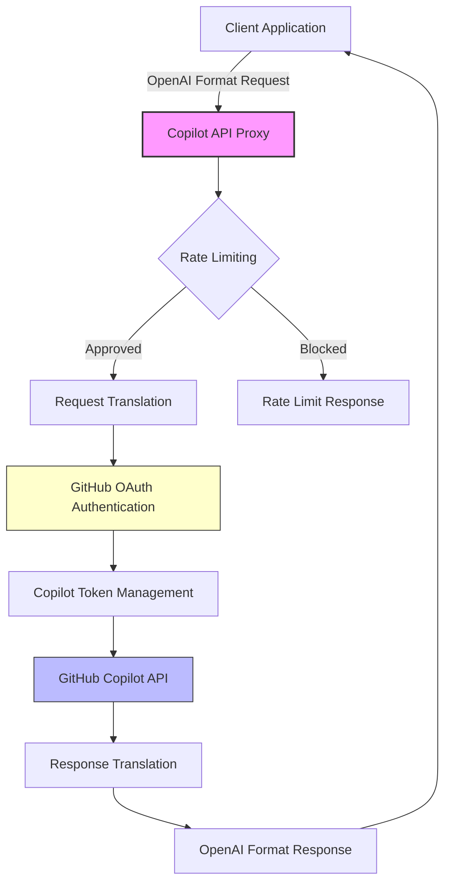

# Copilot API Documentation

Welcome to the comprehensive documentation for the GitHub Copilot API proxy - a TypeScript/Node.js server that wraps GitHub Copilot's API to make it OpenAI-compatible.

## Overview

This project provides an OpenAI-compatible proxy layer for GitHub Copilot, enabling integration with AI assistants, local interfaces, and development tools that expect OpenAI's API format. The proxy handles authentication, request translation, and response formatting automatically.

⚠️ **EDUCATIONAL PURPOSE ONLY** ⚠️  
This is a reverse-engineered implementation created for educational purposes. It is not officially supported by GitHub and should not be used in production environments.

## Quick Start

### Using npx (Recommended)
```bash
# Start the server
npx copilot-api@latest start

# Custom port
npx copilot-api@latest start --port 8080

# Generate GitHub token only
npx copilot-api@latest auth
```

### Using Docker
```bash
docker build -t copilot-api .
docker run --init -it -p 4141:4141 copilot-api
```

### From Source
```bash
git clone https://github.com/ekartashov/copilot-api.git
cd copilot-api
bun install
bun run dev
```

## Key Features

- **OpenAI API Compatibility**: Translates OpenAI-style requests to GitHub Copilot format
- **GitHub OAuth Authentication**: Secure device flow authentication with GitHub
- **Rate Limiting**: Built-in request throttling with configurable limits
- **Business Account Support**: Compatible with both individual and business Copilot subscriptions
- **Multiple Installation Methods**: Run via npx, Docker/Podman, or from source
- **Manual Request Approval**: Optional interactive mode for request review
- **Vision Support**: Handle image inputs in chat completions
- **Stream & Non-Stream Support**: Compatible with both streaming and non-streaming responses

## Architecture Overview



The proxy operates as a translation layer between OpenAI-compatible clients and GitHub's Copilot backend, handling:

1. **Request Processing**: Receives OpenAI-format requests from clients
2. **Authentication**: Manages GitHub OAuth and Copilot token lifecycle
3. **Translation**: Converts between OpenAI and Copilot API formats
4. **Rate Management**: Enforces configurable rate limits and optional manual approval
5. **Response Handling**: Streams or returns formatted responses to clients

## Documentation Structure

This documentation is organized into focused sections:

### Core Documentation
- **[CLI Usage](cli.md)** - Command-line interface and options
- **[API Reference](api.md)** - OpenAI-compatible endpoints and formats
- **[Authentication](auth.md)** - GitHub OAuth flow and token management
- **[Configuration](config.md)** - Environment variables and runtime settings

### Deployment & Development
- **[Deployment Guide](deployment.md)** - Docker, Podman, and npx deployment
- **[Architecture](architecture.md)** - Detailed system design and implementation
- **[Contributing](contributing.md)** - Developer workflow and guidelines
- **[Testing](testing.md)** - Test structure and best practices

## Prerequisites

- **GitHub Account**: With active Copilot subscription (Individual or Business)
- **Runtime Environment**: 
  - Bun >= 1.2.x (recommended), OR
  - Node.js with npm, OR
  - Docker/Podman
- **Network Access**: HTTPS connectivity to GitHub APIs

## Supported Endpoints

The proxy provides OpenAI-compatible endpoints:

| Endpoint | Description | OpenAI Equivalent |
|----------|-------------|-------------------|
| `/chat/completions` | Chat completions with streaming | `/v1/chat/completions` |
| `/models` | Available model list | `/v1/models` |
| `/embeddings` | Text embeddings | `/v1/embeddings` |

All endpoints also support the `/v1/` prefix for broader tool compatibility.

## Example Usage

### Basic Chat Completion
```bash
curl -X POST http://localhost:4141/chat/completions \
  -H "Content-Type: application/json" \
  -d '{
    "model": "gpt-4",
    "messages": [{"role": "user", "content": "Hello!"}],
    "stream": false
  }'
```

### Streaming Response
```bash
curl -X POST http://localhost:4141/chat/completions \
  -H "Content-Type: application/json" \
  -d '{
    "model": "gpt-4",
    "messages": [{"role": "user", "content": "Count to 5"}],
    "stream": true
  }'
```

## Legal and Compliance

This project is an educational reverse-engineering effort. Please review:

- **[NOTICE](../NOTICE)** - Legal disclaimers and requirements
- **[LICENSE](../LICENSE)** - MIT License terms
- **[Contributing Guidelines](../CONTRIBUTING.md)** - Compliance requirements for contributors

## Getting Help

- **Issues**: Report bugs on [GitHub Issues](https://github.com/ekartashov/copilot-api/issues)
- **Discussions**: Community support and questions
- **Documentation**: This documentation covers most use cases

## Security Considerations

- **Token Storage**: GitHub tokens are stored securely in `~/.local/share/copilot-api/`
- **Network Security**: All communication uses HTTPS
- **Rate Limiting**: Built-in protections against API abuse
- **Manual Approval**: Optional request review for sensitive environments

---

**Next Steps:**
- Read the [CLI documentation](cli.md) to understand command-line usage
- Review the [API reference](api.md) for endpoint details
- Check the [deployment guide](deployment.md) for your preferred installation method
- Explore the [architecture documentation](architecture.md) for implementation details